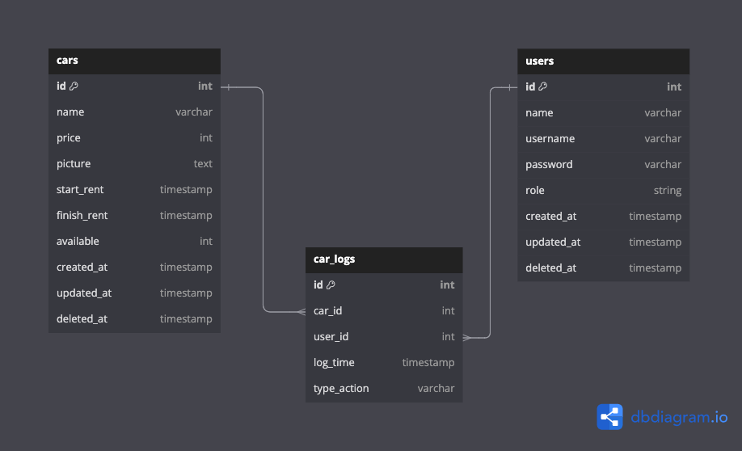

### SYNRGY 7 BINAR CHALLENGE 7 RESTFUL API FOR REACT INTEGRATION FSW 2 HAFIIDH LUQMANUL HAKIM

### INSTRUCTION
1. Clone project into your local
2. Change directory to this project folder `cd 24001160-synrgy7-haf-bcr-ch7/be`
3. Use command `npm install`
4. Next step use command `npm run compile` to compile TypeScript into JavaScript
5. Make sure copy `.env.example` file to `.env` and fill up the correct value of your PostgreSQL connection!
6. Run this command `node -e "console.log(require('crypto').randomBytes(32).toString('hex'))"` and copy the value into your `.env` file in `JWT_SECRET`
7. Run command `npx knex migration:latest` to create table via migration
8. Run command `npx knex seed:up` to fill up table with data seeder!
9. For final step run command `npm run start`
10. Make sure database already connected to your project like this
   

11. for super admin login, use email `superadmin@email.com` and password `superadmin`

12. Access endpoint `/api-docs` for Swagger Documentation API

13. Have fun and enjoy! (Becareful it's fragile)

### ERD (Entity Relationship Diagram)

